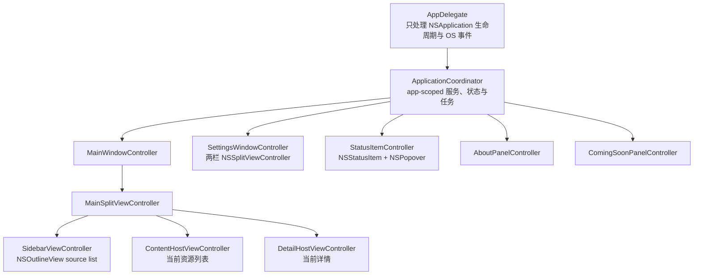
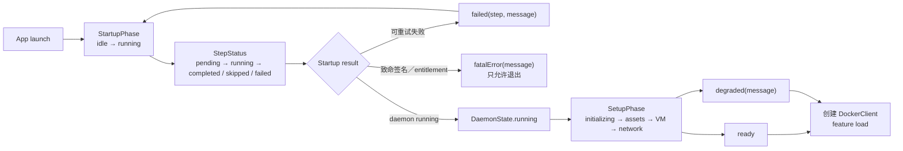

# ArcBox Desktop：SwiftUI → AppKit 迁移档案

> 快照日期：2026-08-01
> 状态：迁移进行中；AppKit 生命周期壳、原生窗口／菜单／主侧栏、认证桥接、About、Coming Soon、
> 共享 `LoadPhase`、terminal／command empty state、Volumes／Networks／Images 原生列表与
> Networks 原生详情已落地
> 目标：第一方运行时代码最终不再依赖 SwiftUI、Swift Charts、`NSHostingView` 或
> `NSViewRepresentable` 或 `NSViewControllerRepresentable`

当前过渡边界：主窗口外层为 AppKit 固定侧栏与内容容器；Volumes／Networks／Images 的列表行、
分组、选择及 loading／empty／error 已由 AppKit 接管，Networks 的 Info／Connected Containers
详情亦已原生化。其 toolbar、创建 sheet 与其他详情仍在过渡 host。其他内容／详情、设置与菜单栏
中尚未迁移的 feature 临时使用 `NSHostingController`。这一边界只用于保持每个迁移提交可运行，
最终静态门槛仍要求全部删除。

## 1. 范围、假设与完成定义

### 1.1 范围

- 包含当前工作树中的 `ArcBox/` app target，以及
  `Packages/ArcBoxAuth/Sources/ArcBoxAuth/Session/AuthSession+SignIn.swift`。
- `Packages/ArcBoxClient`、`DockerClient`、`K8sClient` 的业务与状态 API 保留；只调整 AppKit
  集成所需的边界。
- 不包含第三方 checkout、`.build`、其他 worktree、Rust daemon UI 或构建缓存。
- 测试只纳入与真实窗口布局、状态机和深链有关的部分；不为每个原生控件增加低价值镜像测试。

### 1.2 已采用的决策

| 决策 | 结论 |
|---|---|
| 「全部迁移」的含义 | 最终第一方运行时为纯 AppKit；不可达 SwiftUI 直接删除，不逐行翻译 |
| 最低系统 | 继续支持 `macOS 15`；架构不依赖 `macOS 26` API |
| 状态模型 | 保留现有 `@Observable` domain model；不用 Redux、Combine 或巨型 `AppState` |
| 依赖 | 不增加 UI 依赖；优先 AppKit、Observation、Core Animation 和现有 SwiftTerm／Sparkle |
| 窗口 | 主窗口、设置、关于、Coming Soon 都保持单例 controller |
| 迁移过程 | 中间提交可暂时托管尚未迁移的 SwiftUI feature，以保持每个提交可运行；最终门槛为零 host |
| 死功能 | Templates 的真实页面、`NetworkSettingsView` 和已确认无调用组件直接删除 |
| 行为兼容 | 保留深链、菜单栏、关闭后继续运行、强制退出、终端常驻、文件操作和 Sparkle 行为 |

`NSSplitViewItemAccessoryViewController` 和自动 AppKit Observation 是新工具链可简化的能力，
但都不是当前迁移的结构前提。只有在最低系统与当前 SDK 上做过运行证明后才启用。

### 1.3 完成定义

静态门槛：

```bash
rg -n '^(import SwiftUI|import Charts)|\b(NSHostingView|NSHostingController|NSViewRepresentable|NSViewControllerRepresentable|WebAuthenticationSession)\b|#Preview' \
  ArcBox ArcBoxTests Packages/ArcBoxAuth -g '*.swift'
```

最终应无输出。之后：

```bash
make generate-xcodeproj
make format
make lint
make build
make test
```

还必须完成第 10 节的真实窗口与状态验收；仅仅编译通过不算迁移完成。

## 2. SwiftUI 基线盘点

### 2.1 数量

迁移开始时工作树有：

| 项目 | 数量 |
|---|---:|
| `ArcBox/` Swift 文件 | 197 |
| `ArcBox/` 中直接导入 SwiftUI | 126 |
| `ArcBoxAuth` 中直接导入 SwiftUI | 1 |
| 合计直接导入 SwiftUI | 127 |
| `#Preview` | 9 |
| `NSViewRepresentable` | 2 |
| `NSHostingView` | 2 |
| `NSViewControllerRepresentable` | 0 |
| `@Observable` 类型 | 25 |
| `@State` | 172 |
| `@Binding` | 7 |
| `@Environment` | 122 |
| `@AppStorage` | 18 |
| `@SceneStorage`／`@FocusState` | 0 |

这是工作树快照，不复制一份容易过期的 127 项文件清单。以下命令是迁移期间的权威 manifest：

```bash
rg -l '^import SwiftUI' ArcBox Packages -g '*.swift' | sort
```

### 2.2 `ArcBox/` 分组

| 区域 | 直接导入 SwiftUI 的文件数 | 说明 |
|---|---:|---|
| `ArcBoxApp.swift` | 1 | app scene、窗口、commands、根对象 |
| `App/` | 1 | SwiftUI environment 注入 |
| `Components/` | 14 | 公共控件、terminal／outline bridge |
| `Models/` | 5 | 主要为 `Color`、导航或 view 类型反向依赖 |
| `Theme/` | 3 | `Color`、modifier、Liquid Glass |
| `ViewModels/` | 11 | 主要为 `Color` 或 view-owned enum 反向依赖 |
| `Views/` | 91 | 所有可见界面 |

`Views/` 的 91 个文件全部落在以下分组：

| Feature | 文件数 | 当前入口 |
|---|---:|---|
| About | 5 | App menu |
| Activity | 3 | 主 sidebar、菜单栏跳转 |
| Check for Updates | 1 | App menu |
| Coming Soon | 1 | Templates gate |
| Containers | 14 | Docker sidebar |
| Content shell | 1 | 主三栏 |
| Images | 7 | Docker sidebar |
| Kubernetes | 7 | Pods／Services |
| Machines | 9 | Linux sidebar |
| Menu bar | 6 | `MenuBarExtra` |
| Networks | 6 | Docker sidebar |
| Sandboxes | 11 | Sandbox sidebar |
| Settings | 6 | 设置窗口 |
| Shared state UI | 3 | startup、daemon、avatar |
| Sidebar account | 1 | 主 sidebar 底部 |
| Templates | 4 | 当前被 Coming Soon gate |
| Volumes | 6 | Docker sidebar |

### 2.3 SwiftUI surface

当前没有 `WindowGroup`、SwiftUI `Settings` scene、`NavigationStack`、`TabView`、`.popover`、
`.inspector` 或 `.fullScreenCover`。主要 surface 为：

| Surface | 数量 |
|---|---:|
| `NavigationSplitView` | 2 |
| `.task` | 39 |
| `.onChange` | 28 |
| `.toolbar` | 18 |
| `.searchable` | 8 |
| `.sheet` | 6 |
| `.confirmationDialog` | 8 |
| `.alert` | 5 |
| `.contextMenu` | 7 |
| toast 使用点 | 5 |
| `ProgressView` | 24 |
| `ContentUnavailableView` | 5 |
| SwiftUI `Table` | 1 |
| Swift Charts | Activity 指标条 1 处 |

## 3. 目标所有权与控制器树



`AppDelegate` 不应变成所有业务对象的垃圾桶。最小且耐久的边界是：

| Owner | 持有 |
|---|---|
| `ApplicationCoordinator` | daemon、startup、auth、clients、event monitors、sleep/wake、共享资源 stores、updater、preferences、app 级 tasks |
| `MainWindowController` | 主窗口、当前导航、split items、toolbar、可被深链访问的选择路径、feature controllers |
| `SettingsWindowController` | 设置选择、设置 child controllers、设置操作错误呈现 |
| `StatusItemController` | `NSStatusItem`、popover、popover 显示期间的 stats task |
| Feature controller | search、tab、sheet 呈现、页面级 task 和渲染 |
| Sheet controller | draft、提交中、表单错误、取消策略 |
| Domain store | items、selection ID、load phase、refresh error、业务操作 |

不新增通用 presentation store、binding 框架或 controller factory。

### 3.1 现有对象迁移

当前由 [`ArcBoxApp.swift`](../ArcBox/ArcBoxApp.swift#L14) 根持有的对象迁入
`ApplicationCoordinator`：

- `AppViewModel`
- `DaemonManager`
- `AuthSession`
- `ArcBoxClient?`、`DockerClient?`
- Docker／Sandbox／Machine event monitors
- `SleepWakeManager`
- `StartupOrchestrator?`
- Containers、Images、Networks、Volumes stores
- `SystemVmBackendModel`
- Sparkle controller 与 settings model

当前由 [`ContentView.swift`](../ArcBox/Views/ContentView.swift#L37) 本地持有的 Activity、
Kubernetes、Machines、Sandboxes stores 由 `MainWindowController` 持有。Templates 不迁移。

当前菜单栏自己的 `ActivityViewModel` 应删除；主窗口与菜单栏消费同一 stats source，避免两条 stream
和两套真相。

## 4. 窗口信息架构

### 4.1 窗口与 panel

| Surface | 当前 | AppKit 目标 | 几何与约束 |
|---|---|---|---|
| 主窗口 | `Window("ArcBox", id: "main")` | 单例 `MainWindowController` | 默认 `1200 × 800`；最小 `900 × 600`；frame autosave |
| 设置 | 普通 SwiftUI `Window` | 单例 `SettingsWindowController` | 默认 `700 × 580`；内容尺寸控制 |
| 菜单栏 | `MenuBarExtra(.window)` | `NSStatusItem` + transient `NSPopover` | 内容宽 260；容器最多 8 行 |
| 关于 | `NSPanel` + `NSHostingView` | 保留 panel，换原生 content controller | `500 × 660`；单例；Esc 关闭 |
| Coming Soon | floating `NSPanel` + `NSHostingView` | 保留 panel，换原生 content controller | `280 × 260`；失焦隐藏；Esc／OK 关闭 |

证据：

- [`ArcBoxApp.swift`](../ArcBox/ArcBoxApp.swift#L57)
- [`AboutWindow.swift`](../ArcBox/Views/About/AboutWindow.swift#L18)
- [`ComingSoonPanel.swift`](../ArcBox/Views/ComingSoonPanel.swift#L18)

主窗口和设置不再通过标题扫描 `NSApp.windows`。Coordinator 强持有 controller，并提供
`showMainWindow()`、`showSettings(tab:)`、`showAbout()`。

### 4.2 主窗口

主窗口继续是三栏，不改为 push navigation：

| 栏 | 当前 | AppKit |
|---|---|---|
| Sidebar | 固定宽 180 | `NSSplitViewItem(sidebarWithViewController:)` + source-list `NSOutlineView` |
| Content list | min 280／ideal 320／max 600 | `NSSplitViewItem(contentListWithViewController:)` |
| Detail | 剩余空间 | 普通 `NSSplitViewItem` |

Activity 选中时折叠 content list。底部账户区使用 sidebar 内「滚动内容 + 固定 footer」容器，
不为 `macOS 26` accessory API 增加两套结构。

Sidebar IA：

| Section | Destination |
|---|---|
| System | Activity |
| Docker | Containers、Volumes、Images、Networks |
| Kubernetes | Pods、Services |
| Linux | Machines |
| Sandbox | Sandboxes、Templates（仅 Coming Soon） |

Feature IA：

| Destination | Content list | Detail／页签 | Store owner |
|---|---|---|---|
| Activity | 折叠 | 全宽 metrics + container outline | 主窗口 |
| Containers | Compose 分组列表 | Info／Logs／Terminal／Files | app 共享 |
| Volumes | In Use／Unused | Info／Files | app 共享 |
| Images | In Use／Unused | Info／Terminal／Files | app 共享 |
| Networks | In Use／Unused | Info + Connected Containers | app 共享 |
| Pods | 列表 | Info／Logs／Terminal；后两项当前为 placeholder | 主窗口 Kubernetes owner |
| Services | 列表 | Info | 主窗口 Kubernetes owner |
| Machines | Running／Stopped | Info／Logs／Terminal／Files | 主窗口 |
| Sandboxes | List／Monitoring | Info／Terminal／Files／Ports／Snapshots／Events | 主窗口 |
| Templates | 不建立列表 | 只显示 Coming Soon panel 并恢复旧导航 | 无 store |

Image Terminal 当前切换 tab 时只改变可见性、不销毁 terminal。AppKit child controller 必须同样常驻。

### 4.3 设置

设置保持两栏：

- General
- Account
- System
- Storage

Network、Machines、Docker、Kubernetes 当前只是注释或未来项，不建立 controller。
`settingsTab` 仍需跨窗口设置，因此保留 app 级选择；其 enum 从 SwiftUI view 文件移到模型层。

### 4.4 导航与深链

| 来源 | 行为 |
|---|---|
| `arcbox://main` | 打开主窗口 |
| `arcbox://settings` | 打开设置 |
| `arcbox://<section>[/<id>]` | 打开主窗口、选择 sidebar、可选资源 |
| 菜单栏 CPU／Memory | Activity |
| 菜单栏 Volumes／Images／Networks | 对应 Docker feature |
| 菜单栏 container row | Containers + selected container ID |
| Activity 双击／context menu | Containers + selected container ID |
| 已登录 account footer | Settings > Account |
| 未登录 account footer | 开始认证 |

当前 ID 深链仅支持 Containers、Volumes、Images、Networks。AppKit 迁移首先保持该行为；如果要扩展
Machines／Sandboxes ID 深链，应作为独立产品改动，不夹在迁移中。

### 4.5 Menu、toolbar 与 responder chain

主 `NSToolbar` 由 `MainWindowController` 单点持有：

- `NSSearchToolbarItem`：当前 feature 的搜索。
- `NSMenuToolbarItem`：排序。
- `NSToolbarItem`：新增、Kubernetes toggle、status。
- `NSToolbarItemGroup` + `NSSegmentedControl`：详情 tabs。
- 两个 `NSTrackingSeparatorToolbarItem`：对应 split dividers。

`⌘N` 只在 main menu 注册一次，target 为 nil；当前 content controller 响应
`newResource(_:)`，并通过 menu validation 控制可用性。`⌘,`、About、Check for Updates、Quit
由 app coordinator／Sparkle 处理。

现有 `.navigationTitle`／`.navigationSubtitle` 不是一律映射到 window title。主窗口 title 保持
「ArcBox」，当前 pane 的 title／subtitle 由 toolbar item 或 content header 呈现。

### 4.6 呈现清单

#### Sheet：6 个

| Feature | Sheet | 当前尺寸 |
|---|---|---:|
| Containers | New Container | `480 × 560` |
| Images | Pull Image | `480 × 270` |
| Volumes | New Volume | `480 × 240` |
| Networks | New Network | `640 × 430` |
| Machines | New Machine | `440 × 460` |
| Sandboxes | New Sandbox | `480 × 540` |

每个 sheet 使用 feature-specific `NSWindowController` + `beginSheet`。删除 store 中的
`show…Sheet` 布尔值；draft、提交中和表单错误只属于 sheet controller。

#### Dialog：13 个

- 8 个 confirmation：Compose group、Container、Image、Network、Volume、Machine、Sandbox
  删除，以及 Account sign-out。
- 5 个 alert：Sandbox operation、external terminal selection、Reset Docker、Reset All、
  VM backend switch。

全部改为 `NSAlert.beginSheetModal(for:)`。删除按钮使用 destructive appearance；controller
记录正在显示的 alert，避免 Observation 重新 render 后重复弹出。

#### 其他呈现

- 5 个自动消失 toast：Containers、Images、Volumes、Networks、Machines。
- 7 个 SwiftUI context menu：Activity、Container、Image、Network、Pod、Service、Volume。
- 1 个已存在的 AppKit 文件树 context menu。
- 6 个 `NSOpenPanel`／`NSSavePanel` 使用点：Image import、Volume import、external terminal、
  diagnostics export、Sandbox upload／download。
- Sparkle 自己拥有更新窗口。
- Finder、外部 terminal、网页由 `NSWorkspace` 或现有 integration 打开。

## 5. 状态所有权与流转

### 5.1 启动与 runtime availability

不能把「daemon process 已运行」当成「Docker API 已可用」：



目标只派生一份 runtime availability，不重复存值：

```swift
enum RuntimeAvailability: Equatable {
    case starting
    case fatal(String)
    case daemonUnavailable(String?)
    case dockerStarting(String?)
    case ready
    case degraded(String?)
}
```

所有 Docker controller 只在
`daemonManager.setupPhase.isDockerReady && dockerClient != nil` 时调用 API。
`dockerSocketLinked` 只代表 CLI symlink，不参与 Docker API readiness。

启动 orchestration、client 创建、event monitor、sleep/wake 和 context 管理从 SwiftUI window
`.task` 移到 `ApplicationCoordinator`。关闭主窗口不得停止这些 app-scoped tasks。

### 5.2 最小加载语义

Containers 和 Machines 已有可复用的正确语义：

```swift
enum LoadPhase: Equatable {
    case waiting
    case loading
    case loaded
    case failed(String)
}
```

`items` 与 `phase` 分开保存。首次失败用全页错误 + Retry；已经有缓存时刷新失败保留内容，并写入独立
`refreshError`。不要再让一个 `lastError` 同时承担 sheet 表单错误、modal alert 和 4 秒 toast。

### 5.3 可见状态矩阵

| Surface | 当前 loading | 当前真实空 | 当前错误 | 缓存刷新失败 | 目标 |
|---|---|---|---|---|---|
| Startup | step progress | 不适用 | Retry／fatal Quit | 不适用 | 保留；补 degraded message |
| Containers | 明确 | 明确 | 首次 Retry | list + toast | 作为资源列表基准 |
| Images | 明确 | 明确 | 首次 Retry | list + toast | AppKit 列表已完成；startup／toolbar／detail 待迁移 |
| Volumes | 明确 | 明确 | 首次 Retry | list + toast | AppKit 列表已完成；startup／toolbar／detail 待迁移 |
| Networks | 明确 | 明确 | 首次 Retry | list + toast | AppKit 列表与详情已完成；startup／toolbar 待迁移 |
| Network inspect | 明确 | 明确 | 明确 + Retry | 无 | AppKit 详情已完成 |
| Machines | 明确 | 明确 | 首次 Retry | list + toast | 状态契约已完成；AppKit UI 待迁移 |
| Sandboxes | 与空态混用 | 有 | modal alert | 无 | 加 `LoadPhase`、列表级 Retry |
| Sandbox snapshots | 与空态混用 | 有 | 被伪装为空 | 无 | 独立 `LoadPhase` |
| Activity | redacted connecting | 不适用 | 3 次后 unavailable | 保留旧图 | 补 client unavailable、手动 Retry、stale 标记 |
| Sandbox monitoring | 直接显示 `0` 为 live | 不适用 | 无 | 无 | `connecting / live / reconnecting / failed` |
| Kubernetes status | disabled 混合多义 | disabled | RPC 失败被吞 | 无 | 单一 lifecycle enum |
| Pods／Services watch | 首次 `isLoading` | 有 | watch 错误不显示 | 保留旧 items | 暴露 reconnecting／failed |
| Auth | signing in | signed out | error | 不适用 | 补 restoring／signing out／userinfo error |
| Container logs | spinner | no logs／no match | 首次 error 无 Retry | 有日志时 error 隐藏 | 显示 retry 或 stale warning |
| Files | 明确 | 空目录 | 多数可 Refresh | 不适用 | 保留；节点 I/O error 不得吞掉 |
| Terminal | 各 feature 不一致 | unavailable | Retry 不一致 | 不适用 | 统一 5 态并保留原生 view |
| Settings operations | control 回滚 | 不适用 | 多数只写日志 | 不适用 | 可见错误与权限指引 |

资源搜索还必须区分：

1. 尚未加载；
2. 正在加载；
3. 第一次加载失败；
4. 已加载且真实为空；
5. 数据非空但搜索无结果；
6. 有缓存且刷新失败。

### 5.4 Kubernetes

当前 `enabled + isStarting + isStopping + startError` 可组成非法状态，应收敛为：

```swift
enum KubernetesLifecycle: Equatable {
    case checking
    case disabled
    case starting
    case ready
    case stopping
    case failed(Operation, String)
}
```

资源 watch 另有：

```swift
enum StreamPhase: Equatable {
    case connecting
    case live
    case reconnecting(attempt: Int, lastError: String?)
    case failed(String)
}
```

Pods／Services controller 的 task key 必须包含 client identity；第一次出现时 client 为 nil，之后注入
client 必须重启 status 与 watch。status RPC 失败不能静默变成 disabled。

### 5.5 Terminal、logs 与文件

Docker、Machine、Sandbox terminal 当前各自重复
`idle / connecting / connected / disconnected / error`。迁移时统一语义，但不必创建协议层。

原生 controller 持有稳定的 `TerminalView` 后可删除 SwiftUI bridge 为防重建而引入的
`hasConnected`、UUID token 和 `connectedImageID`。页面隐藏时由父 controller 明确
`activate()`／`deactivate()`；Image Terminal 只隐藏，不销毁。

文件树的节点加载目前有 `try? … ?? []`，会把权限或 I/O 错误显示为空目录。提升为 AppKit
controller 时必须让错误进入可见状态。

### 5.6 Auth

现有 `signedOut / signingIn / signedIn / error` 基本保留，并补：

- `restoring`：读取 Keychain。
- `signingOut`：撤销或清理 token。
- userinfo 错误：已登录但 profile 不可用。
- Keychain 写入失败：不能只保持内存中的 signed-in 假象。

SwiftUI `WebAuthenticationSession` 改为强持有的 `ASWebAuthenticationSession`，并由当前窗口
controller 提供 `ASWebAuthenticationPresentationContextProviding`。

### 5.7 Preferences

持久化键：

- `showInMenuBar`
- `updateChannel`
- `activity.containerColumns`
- `terminalTheme`
- `externalTerminal`
- `startAtLogin`
- `keepRunning`
- `telemetryEnabled`
- `includeTimeMachine`
- `switchDockerContextAutomatically`
- `pauseContainersWhileSleeping`

必须在 app 启动时一次性 `register(defaults:)`。当前
`switchDockerContextAutomatically` 和 `pauseContainersWhileSleeping` 在 UI 默认 `true`，
后台却用 `bool(forKey:)` 得到未注册键的 `false`；这是迁移前必须修复的首启行为错误。

窗口 frame、split、table columns 不放进 typed preferences，直接用 AppKit autosave：

- `NSWindow.setFrameAutosaveName`
- `NSSplitView.autosaveName`
- `NSTableView.autosaveName`／`autosaveTableColumns`

### 5.8 AppKit Observation 与 task 生命周期

保留 `@Observable` stores，移除它们不需要的 `import SwiftUI`，改用 Foundation／Observation。

当前安装 SDK 为 26.5。基线采用 `withObservationTracking`：

1. controller 构造器显式注入 store；
2. `render()` 只读取本 controller 所需字段；
3. `onChange` 回到 `MainActor` 后重新注册并 render；
4. control → model 用 target/action 或 delegate；
5. table selection → model 用 delegate；
6. programmatic selection → table 在 render 中同步。

不建立通用双向 binding 框架。

Apple 已发布自动 AppKit Observation 指引，并说明 `macOS 15` 可通过
`NSObservationTrackingEnabled` opt in。升级工具链后先做一项最低系统运行测试；证明成立再删除手动
tracking，不能在本次迁移中同时维护两条 observation 路径。

Task 归属：

| Task | Owner | 启停 |
|---|---|---|
| daemon watch、startup、event monitors、sleep/wake | Application coordinator | app launch → real quit |
| Docker/Kubernetes resource load | Feature controller／store | availability key 或 client identity 变化 |
| Activity stats | Activity controller；菜单栏共享 source | controller active／popover visible |
| Terminal／logs／events stream | 对应 detail controller | tab activate／deactivate |
| Sheet operation | Sheet controller | submit → completion／cancel policy |

`.task(id:)` 的等价实现必须保存当前 key；key 改变时先 cancel 旧 task 再启动新 task。

## 6. 空／错／loading 的迁移前优先级

### P0：不能原样翻译

1. 注册所有 `UserDefaults` 默认值，修复两个默认 `true` 设置的首启漂移。
2. 将所有 Docker API gate 统一为 `setupPhase.isDockerReady && dockerClient != nil`。
3. 为 Images、Sandboxes、Snapshots 增加显式 load phase；Volumes、Networks 与 Network inspect
   已完成。
4. 将 Kubernetes 布尔组合改为 lifecycle enum，并让 client identity 驱动 task 重启。
5. 把 app-scoped startup／monitor tasks 从 window `.task` 移到 application coordinator。
6. 消除主窗口与菜单栏重复的 Activity source。

关键证据：

- 偏好默认漂移：
  [`SystemSettingsView.swift`](../ArcBox/Views/Settings/SystemSettingsView.swift#L10)、
  [`DockerContextManager.swift`](../ArcBox/Integrations/Docker/DockerContextManager.swift#L31)、
  [`SleepWakeManager.swift`](../ArcBox/Integrations/System/SleepWakeManager.swift#L70)。
- Docker 组合 readiness key：
  [`ContainersListView.swift`](../ArcBox/Views/Containers/ContainersListView.swift#L98)。
- Kubernetes 布尔状态与 task：
  [`KubernetesState.swift`](../ArcBox/ViewModels/KubernetesState.swift#L14)、
  [`PodsListView.swift`](../ArcBox/Views/Kubernetes/PodsListView.swift#L89)。
- Window-owned startup：
  [`ArcBoxApp.swift`](../ArcBox/ArcBoxApp.swift#L73)。
- 重复 Activity owner：
  [`ContentView.swift`](../ArcBox/Views/ContentView.swift#L37)、
  [`MenuBarView.swift`](../ArcBox/Views/MenuBar/MenuBarView/MenuBarView.swift#L17)。

### P1：随对应 feature 一起修

1. 搜索无结果不能显示空白。
2. 有缓存时刷新失败要保留内容并显示非阻塞错误。
3. sheet 提交中显示进度并明确是否允许取消；部分批量失败不能自动关闭。
4. 「Create & Start」的 start 失败不能被 create 成功掩盖。
5. Kubernetes stop／watch、container logs、sandbox events 的错误必须可见。
6. 文件树权限和 I/O 错误不能伪装成空目录。
7. Auth 增加 restoring／signing out／userinfo 与 Keychain error。

### P2：原生 UI 完成时验收

1. Reduce Motion。
2. 自定义 chart、badge、icon-only button 的 accessibility label／role。
3. stale 数据和 reconnecting 的视觉区分。
4. `macOS 15` 与 `macOS 26` 的材质差异。

## 7. SwiftUI → AppKit 组件映射

### 7.1 生命周期、窗口与导航

| SwiftUI | AppKit | 迁移说明 |
|---|---|---|
| `@main App` | `@main AppDelegate` + coordinator | app-scoped 状态与 task 不挂在窗口 |
| `Window` | `NSWindowController` | 单例、frame autosave、明确强引用 |
| `MenuBarExtra(.window)` | `NSStatusItem` + `NSPopover` | popover delegate 启停 stats |
| `NavigationSplitView` | `NSSplitViewController` + `NSSplitViewItem` | 三栏几何保持 |
| sidebar `List` | source-list `NSOutlineView` | section + selection |
| `openWindow` environment | 强持有 controller 的 `showWindow` | 不扫描 window title |
| `CommandGroup` | `NSMenu` + responder chain | `validateMenuItem` |
| `.sheet` | child `NSWindowController` + `beginSheet` | feature-specific |
| `.alert`／`.confirmationDialog` | `NSAlert.beginSheetModal` | 防止 render 重入 |
| `.contextMenu` | `NSMenu` + represented object | menu validation |

### 7.2 Layout 与控件

| SwiftUI | AppKit |
|---|---|
| `VStack`／`HStack` | `NSStackView` |
| `ZStack`／overlay | 普通 `NSView` 容器 + 同边 constraints |
| `LazyVStack` | `NSTableView`／`NSOutlineView` |
| `LazyVGrid` | `NSCollectionView`；固定小网格用 `NSGridView` |
| `ScrollView` | `NSScrollView` |
| `ScrollViewReader` | `scrollRowToVisible`／`scrollToEndOfDocument` |
| `GeometryReader`／`Path` | `layout()`／`draw(_:)`／`CAShapeLayer` |
| `Text` | `NSTextField(labelWithString:)` |
| SF Symbol `Image` | `NSImage(systemSymbolName:)` + `NSImageView` |
| `AsyncImage` | 可取消 `URLSession` task + `NSCache` + URL identity check |
| `Button` | `NSButton` + target/action |
| switch `Toggle` | `NSSwitch` |
| checkbox `Toggle` | checkbox `NSButton` |
| segmented `Picker` | `NSSegmentedControl` |
| menu `Picker` | `NSPopUpButton` |
| radio `Picker` | radio `NSButton` group |
| `TextField` | `NSTextField` + delegate |
| `Stepper` | `NSStepper` + value field |
| `ProgressView` | `NSProgressIndicator` |
| `Gauge` | `NSLevelIndicator` |
| `Menu` | `NSMenu`／`NSPopUpButton` |
| `Link` | link-style `NSButton` + `NSWorkspace.open` |
| `LabeledContent` | `NSGridView` 的 label／control 两列 |
| `Divider` | separator `NSBox` |
| `ContentUnavailableView` | 共享轻量 `StatePlaceholderView` |
| `Form` | `NSScrollView` + `NSStackView` + `NSGridView` |

只新增一个 `StatePlaceholderView`，覆盖 loading、empty、error 和可选 action；不为每个 feature
复制一套 placeholder，也不造完整 UI framework。

### 7.3 列表与 feature 组件

| 当前组件 | AppKit 目标 | 说明 |
|---|---|---|
| Containers Compose groups | `NSOutlineView` | section／group／container 节点 |
| Activity `Table` + disclosure rows | 多列 `NSOutlineView` | 原生 sort descriptors 与 column autosave |
| 其他资源列表 | view-based `NSTableView` | group row 表示 Running／Stopped 等 section |
| Detail tabs | toolbar `NSSegmentedControl` + 常驻 child controllers | Image Terminal 不销毁 |
| Info rows | `NSGridView`／`NSStackView` | label/value、可选择文本 |
| Container logs | `NSTextView` | 原生选择、复制、搜索、滚到底部 |
| Activity metric tiles | `NSCollectionViewFlowLayout` | 只有 4 项，不引入 layout 依赖 |
| Swift Charts sparkline | 小型自定义 `NSView` + shape／gradient layers | mouse tracking 完成 scrub |
| Sandbox ports／snapshots／events | `NSTableView` + 顶部 controls | 状态显式化 |
| Menu bar container rows | `NSTableView` | 复用 selection 与 cell lifecycle |

### 7.4 Modifier 与行为

| SwiftUI | AppKit |
|---|---|
| `.frame`／`.padding` | Auto Layout、layout margins、hugging／compression |
| `.fixedSize` | hugging priority |
| `.lineLimit`／truncation | `maximumNumberOfLines`／`lineBreakMode` |
| `.textSelection(.enabled)` | `isSelectable = true` |
| `.disabled` | `isEnabled` |
| `.help` | `toolTip` |
| `.opacity`／`.allowsHitTesting` | `alphaValue`／`isHidden`／`isEnabled` |
| `.clipShape`／shadow | layer corner radius、mask、shadow |
| gradient | `CAGradientLayer` |
| material | `NSVisualEffectView` |
| `.glassEffect` | `macOS 26` 的 `NSGlassEffectView`；`macOS 15` 用 visual effect |
| `.animation`／transition | `NSAnimationContext`／animator proxy |
| `.redacted` | 固定占位文本 + placeholder color |
| `.onTapGesture` on row | table selection delegate |
| `.onHover` | `NSTrackingArea`；优先标准 rollover |
| `.onReceive` | `NotificationCenter` observer token |
| `.task(id:)` | owner 持有 cancellable `Task` + key |
| dismiss environment | `dismiss(nil)`／`endSheet` |
| color scheme | `effectiveAppearance` |

`NSGlassEffectView` 只覆盖当前 Activity 指标条的玻璃使用点。内容必须放进其 `contentView`；
`macOS 15` fallback 由同一个小包装 view 处理。

### 7.5 可以直接复用的 AppKit

| 现有代码 | 处理 |
|---|---|
| `AppDelegate` deep link、keep-running、terminate | 保留，所有权改接 coordinator |
| `DeepLinkRouter` | 保留，closures 改接 window controllers |
| SwiftTerm `TerminalView` | 直接嵌入 |
| `TerminalSessionBridge` | 原样保留 |
| Local RootFS `NSOutlineView` coordinator | 提升为 `NSViewController`，保留 columns、menu、loading |
| `NSOpenPanel`／`NSSavePanel` | 保留 |
| `NSWorkspace`／`NSPasteboard` | 保留 |
| Sparkle updater 与 models | 保留 |
| About／Coming Soon `NSPanel` 外壳 | 保留，替换 content |
| `AppColors` 的 semantic `NSColor` 来源 | 改为直接暴露 `NSColor` |

### 7.6 无 1:1 等价的高风险点

1. Observation 重新注册与 table snapshot 更新。
2. `.task(id:)` 的 cancel／restart，尤其隐藏 tab、popover 与 client identity。
3. 三栏共用 toolbar 的 title、search、primary action、status 和 detail tabs。
4. `TerminalView` 的稳定生命周期和 first responder。
5. Swift Charts 的 line／area／rule／point、scrub 和 accessibility。
6. `macOS 26` Liquid Glass 与 `macOS 15` fallback。
7. `ASWebAuthenticationSession` 的强引用、取消与 presentation context。
8. reusable cells 的异步 icon 取消和 URL identity。
9. Observation render 导致 sheet／alert 重复呈现。
10. 自定义 badge、chart、icon-only action 的 accessibility。

## 8. Feature 迁移矩阵

| 区域 | 目标 controller／view | 先决状态工作 | 复用 | 风险 |
|---|---|---|---|---|
| App shell | Coordinator + window controllers | app tasks 脱离 window | AppDelegate、DeepLinkRouter | 生命周期／quit |
| Main split | `NSSplitViewController` | navigation owner | 现有几何测试意图 | toolbar 分栏 |
| Sidebar | source-list outline + account footer | auth／selection | NavItem 模型 | footer layout |
| Shared states | `StatePlaceholderView` | runtime availability、load phase | startup enums | 不得合并 daemon／Docker ready |
| Activity | full-width controller + outline + metric strip | shared stats source、stream health | Activity VM | chart、scrub |
| Containers | outline + 4 detail children | 已是 load phase 基准 | terminal、files | Compose hierarchy、logs |
| Images | table + 3 detail children | 原生 table／load／empty／error 已完成 | terminal、files | toolbar／detail／pull sheet／terminal 常驻 |
| Volumes | table + 2 detail children | 原生 table／load／empty／error 已完成 | files | toolbar／detail／import sheet 待迁移 |
| Networks | table + detail | 原生 table／detail／inspect load phase 已完成 | Docker store | toolbar／创建 sheet 待迁移 |
| Pods／Services | tables + detail | Kubernetes lifecycle／watch health | K8s clients | reconnect、client injection |
| Machines | table + 4 detail children | cached refresh error | terminal | catalog／inspect error |
| Sandboxes | list／monitoring + 6 detail children | load、monitor、snapshot、event phases | terminal、file panels | surface 最多 |
| Settings | split + form controllers | defaults registration、visible errors | updater／system models | permissions／rollback |
| Auth | Account controller + web auth owner | restoring／signing out | AuthSession | presentation context |
| Menu bar | status item + popover | shared Activity、Docker readiness | shared stores | popover task lifecycle |
| About／Coming Soon | native panel content | 无 | panel lifecycle | 低 |
| Templates | 不迁移 | 无 | 只保留 Coming Soon | 删除 dead UI |

## 9. 不迁移、直接删除

「全部迁移」不包括翻译不可达或无调用代码：

- `ArcBox/Views/Templates/*`
- `TemplatesViewModel`
- Templates sample data 与空操作 toolbar
- `NetworkSettingsView`
- `ListResizeHandle`
- `CardModifier`
- `BadgeModifier`
- `SectionHeaderStyle`
- `TerminalLine`
- `DetailPlaceholderView`
- 9 个当前 SwiftUI `#Preview`
- `EnvironmentValues+Clients.swift`
- `SwiftTermView` 的 representable 壳
- `LocalRootFSOutlineView` 的 representable 壳
- About／Coming Soon 中的 `NSHostingView`
- 自定义 Activity table column JSON；改用 `NSTableView` autosave

删除前再用 `rg` 检查调用者；如果当前工作树在迁移开始前重新接通其中任何功能，应从此清单移除。

## 10. 实施顺序与验收

### 10.1 建议顺序

1. **状态基线**
   修复 P0：preferences、Docker readiness、load phases、Kubernetes lifecycle、Activity owner。

2. **AppKit app shell**
   建立 coordinator、主／设置窗口、status item、menus、deep links 和 quit semantics。尚未迁移的
   feature 可暂时由一个 host 承接，保证每个提交可运行。

3. **共享原生组件**
   `StatePlaceholderView`、resource table／outline 的最小公共配置、toolbar、toast；提升 terminal
   与文件树现有 AppKit 实现。

4. **按垂直 feature 迁移**
   Containers → Volumes／Images／Networks → Machines → Kubernetes → Sandboxes。每个 feature
   同时迁移 list、detail、sheet、menu 和可见状态，不留下半套跨框架状态。

5. **外围窗口**
   Settings／Auth → menu bar → About／Coming Soon。

6. **Activity 与清场**
   最后实现 chart；删除 SwiftUI、Charts、hosts、previews 和 dead UI；再生成 Xcode project。

### 10.2 自动验证

- 保留 `DeepLinkTests`。
- 当前 `MainSplitViewControllerTests` 验证迁移期原生外层两栏、180 pt sidebar floor 与 content
  controller replacement。内容／详情迁出 host 后扩展为最终 AppKit 窗口测试，验证：
  - 3 个 split items；
  - content list 最小 280；
  - 2 个 tracking separators；
  - toolbar item 不越栏；
  - Activity 时 content list 折叠。
- 为新 `LoadPhase` 派生逻辑、Kubernetes lifecycle、preferences 默认值和 task key 增加最小有意义测试。
- `VolumesListViewControllerTests`、`NetworksListViewControllerTests` 与
  `ImagesListViewControllerTests` 验证空态到分组 table、连续 Observation 重注册、搜索、
  选择同步与 controller 释放。
- `NetworkDetailViewControllerTests` 验证无选择、inspect error／Retry／真实空态与 controller
  释放。
- 不测试 `NSTextField` 是否能显示文本、`NSButton` 是否会发 action 等框架保证。

### 10.3 手工验收矩阵

#### Window 与生命周期

- 冷启动主窗口尺寸、最小尺寸、三栏 divider、frame 恢复。
- `⌘,`、About、Check for Updates、`⌘N` responder chain。
- 关闭主窗口后从 Dock、menu bar、deep link 重开。
- `keepRunning + showInMenuBar` 时关闭窗口不退出。
- menu bar 的 Quit 走真实 shutdown：停 monitors、恢复 Docker context、关闭 client、禁用 daemon。
- 设置与关于不重复创建窗口。

#### Startup 与 daemon

- step progress → daemon running → Docker starting → loaded／真实空。
- 可重试失败。
- fatal 签名／entitlement 错误，只显示 Quit。
- degraded 可见但 Docker API 仍可使用。
- daemon watch 约 3 秒断线宽限与恢复。
- 在 client 尚未注入时依次打开每个导航页。

#### 资源状态

- 首次 loading。
- 第一次失败 + Retry。
- 已加载真实空。
- 数据非空但搜索无结果。
- 有缓存时刷新失败，内容保留且 warning 可见。
- selection 由 deep link、menu bar、Activity 写入时 table 与 detail 同步。

#### Feature

- Containers Compose 展开、操作、logs、terminal、files。
- Image terminal 在 tab 切换后保持会话。
- file tree 权限／I/O error 不显示为空目录。
- Kubernetes status failure、start timeout、watch reconnect、stop failure。
- Sandbox create 部分失败、monitor reconnect、snapshot failure、events reconnect。
- sheet 提交中关闭／取消策略、错误不自动消失。
- Auth restore、cancel、sign-in、userinfo failure、sign-out、Keychain failure。
- 全新 UserDefaults 下两个默认 `true` toggle 的 UI 与真实行为一致。

#### 平台与辅助功能

- `macOS 15`：无 `macOS 26` API crash，visual effect fallback 正常。
- `macOS 26`：Liquid Glass 只用于原有 Activity 指标条。
- Reduce Motion。
- VoiceOver 可读 sidebar、tables、badge、chart、icon-only buttons。
- Dark／Light appearance。

## 11. 官方 AppKit 依据

- [NSSplitViewController](https://developer.apple.com/documentation/appkit/nssplitviewcontroller)
- [NSSplitViewItem](https://developer.apple.com/documentation/appkit/nssplitviewitem)
- [NSStatusItem](https://developer.apple.com/documentation/appkit/nsstatusitem)
- [NSPopover](https://developer.apple.com/documentation/appkit/nspopover)
- [NSTableViewDiffableDataSource](https://developer.apple.com/documentation/appkit/nstableviewdiffabledatasource-c5gl)
- [NSGlassEffectView](https://developer.apple.com/documentation/appkit/nsglasseffectview)
- [NSVisualEffectView](https://developer.apple.com/documentation/appkit/nsvisualeffectview)
- [ASWebAuthenticationSession](https://developer.apple.com/documentation/authenticationservices/aswebauthenticationsession)
- [withObservationTracking](https://developer.apple.com/documentation/observation/withobservationtracking(_:onchange:))
- [AppKit Observation tracking](https://developer.apple.com/documentation/appkit/updating-views-automatically-with-observation-tracking-in-appkit)
